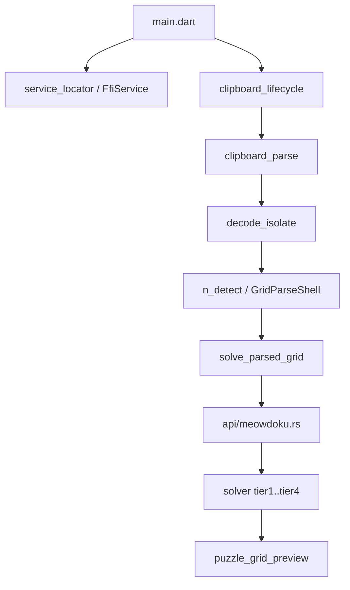

# Project Health Audit — Baseline Snapshot

**Recorded:** 2026-06-11  
**Branch:** `main` (audit run on working tree)  
**Purpose:** Phase 0 baseline for the Project Health Audit plan.

---

## Merge-ready gate (2026-06-11)

| Check | Result | Detail |
|-------|--------|--------|
| `flutter analyze` | **WARN** | 1 info: unnecessary `dart:typed_data` import in `lib/image/decode_isolate.dart` |
| `flutter test` | **PASS** | 46 tests, 0 failures |
| `cargo test --lib` | **PASS** | 20 tests, 0 failures |
| Tier 2 (not re-run this audit) | Last known **PASS** | 6 integration tests per QC_STATUS |

**Effective merge bar:** Tier 1a + 1b green; analyze has one cosmetic info (non-blocking).

---

## Test inventory

| Tier | Location | Files | Tests |
|------|----------|-------|-------|
| 1a | `meowdoku_helper/rust/src/**/*.rs` | 8 modules | 20 |
| 1b | `meowdoku_helper/test/` | 15 | 46 |
| 2 | `meowdoku_helper/integration_test/` | 1 (+ loader) | 6 |

---

## Phase completion (PM_PLAN)

| Phase | Status | Notes |
|-------|--------|-------|
| 0 Bootstrap | Done | Agentic layer, SDD, rename |
| 1 Rust core T1 | Done | Board + halo + naked singles |
| 1b Wordle removal | Done | FRB → Star Battle only |
| 2 Image pipeline | Done | Clipboard, isolate, N-detect, seq 01–02 goldens |
| 3 UI + E2E wire | Done | seq-08 integration (parser N=8) |
| 4a–4d Solver T2–T4 | Done | seq 22–30 T4 gate |
| 5 Progressive sizing | Done | seq 14, 29–30 Tier 2 |
| 6 EPIC-6 T4/T5/T6 | **Pending** | Phantom, Crowding, DFS rename |

---

## Directory inventory

### Repo root

```
MeowdokuHelper/
├── meowdoku_helper/     # Flutter + Rust app
├── assets/test_fixtures/  # 42 canonical board JPEGs (Tier 1 source)
├── assets/reference/      # 1 EPIC-6 hint mockup
├── doc/                   # Tracked product docs (authoritative)
├── docs/                  # Template/setup/archive (partially stale)
├── .cursor/               # Rules, skills, handoff
└── PM_PLAN, TECH_DEBT, AGENT_HANDOFF, …
```

### `meowdoku_helper/lib/` (19 files)

| Path | Role |
|------|------|
| `main.dart` | App entry, FFI bootstrap, clipboard orchestration, shell UI |
| `service_locator.dart` | `setupServices()` → FfiService |
| `app/clipboard_lifecycle.dart` | Resume → callback |
| `app/solve_parsed_grid.dart` | GridParseShell → FRB |
| `app/puzzle_grid_preview.dart` | N×N grid + highlight |
| `image/*` | JPEG parse pipeline (8 files) |
| `services/ffi_service.dart` | RustLib.init wrapper |
| `exceptions/service_exceptions.dart` | Template exception hierarchy |
| `src/rust/` | Generated FRB bindings |

**Absent vs DEV_GUIDE:** `controllers/`, `screens/`, `widgets/`, `assets/word_lists/`

### `meowdoku_helper/rust/src/`

| Path | Role |
|------|------|
| `api/simple.rs` | `init_app()` |
| `api/meowdoku.rs` | `calculate_next_move()` |
| `solver/board.rs` | Board model |
| `solver/tier1.rs`–`tier4.rs` | CSP algorithms |
| `solver/t4_fixtures.rs` | Rust T4 golden gate |
| `frb_generated.rs` | Generated |

---

## Validated code flow



**Import validation:** All call sites match diagram. `main.dart` is the only orchestrator; no circular deps between `image/` and `app/`.

---

## Documentation drift (verified)

| Doc | Issue |
|-----|-------|
| `.cursor/skills/DEV_GUIDE.md` | Lists removed Wordle layout; FRB 2.11.1 vs actual 2.12.0 |
| `meowdoku_helper/README.md` | Entire Wordle product description |
| `doc/QC_STATUS.md` | Counts 6 Flutter / 8 Rust tests (stale) |
| `docs/TESTING_STRATEGY.md` | Wordle-era strategy |
| `.cursor/skills/TEST_TDD.md` | References non-existent test paths |

---

## Fixture catalog

- **Total:** 42 files in `assets/test_fixtures/`
- **Parse goldens locked:** seq 01–02 (`grid_goldens.dart`), seq 22–30 (`t4_solver_goldens.dart`)
- **Tier 2 bundled:** 4 files in `integration_test/fixtures/` (08, 14, 29, 30)
- **Uncovered:** 30 fixtures (no parse golden, no E2E)

---

## Next document

Full findings: [PROJECT_HEALTH_AUDIT.md](PROJECT_HEALTH_AUDIT.md)
