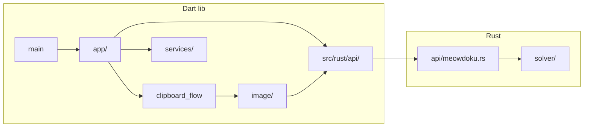

# Project Health Audit — Baseline Snapshot

**Recorded:** 2026-06-12 (Phase 7 boundary refresh)  
**Branch:** `main` @ post–Phase 7 closure  
**Prior baseline:** [2026-06-11 snapshot](AUDIT_BASELINE.md) — superseded counts below  
**Full findings:** [PROJECT_HEALTH_AUDIT.md](PROJECT_HEALTH_AUDIT.md)

---

## Merge-ready gate (2026-06-12)

| Check | Result | Detail |
|-------|--------|--------|
| `flutter analyze` | **PASS** | No issues (was 1 info on 2026-06-11) |
| `flutter test` | **PASS** | 119 passed, 48 skipped (FFI when native lib absent) |
| `cargo test --lib` | **PASS** | 34 tests |
| `qa_oracle_audit.sh --strict` | **PASS** | P1/P2 cleared (Phase 7 Q6) |
| Tier 2 | **PASS** | 6/6 GitHub `macos-14` (CI run 27444146040) |

---

## Test inventory

| Tier | Location | Files | Tests (approx) |
|------|----------|-------|----------------|
| 1a | `meowdoku_helper/rust/src/**/*.rs` | 12 modules | 34 |
| 1b | `meowdoku_helper/test/` | 28 | 119 (+48 skip) |
| 2 | `meowdoku_helper/integration_test/` | 1 (+ loader) | 6 |

**New since 2026-06-11:** `qa_p2_oracle_audit_test.dart` (18), `qa_t6_oracle_audit_test.dart`, `qa_t2_t3_oracle_audit_test.dart`, `t2_t3_fixture_gate_test.dart`, `grid_goldens.dart` parse lock 03–08, `clipboard_flow.dart` + tests.

---

## Phase completion (PM_PLAN)

| Phase | Status | Notes |
|-------|--------|-------|
| 0–5 | Done | Bootstrap through progressive sizing |
| 6 EPIC-6 T4/T5/T6 | **Done** | Phantom, Crowding, DFS rename |
| 7 QA hardening | **Done** | Q1–Q6; strict oracle audit PASS (2026-06-12) |
| 8 Fixture + hint truth | **Planned** | H1–H4 in PM_PLAN |

---

## Delta vs 2026-06-11 audit

| Area | Was | Now | Verdict |
|------|-----|-----|---------|
| Oracle P1/P2 | Pending | **PASS** strict audit | **Improved** |
| Parse goldens | seq 01–02 | seq **01–08** locked | **Improved** |
| Solve gates | seq 22–30 only | + **01–02** human-verified, **09–17** T2/T3 | **Improved** |
| FFI silent pass | FAIL | Explicit skip via `native_ffi.dart` | **Fixed** |
| Clipboard FSM | in `main.dart` | `clipboard_flow.dart` extracted | **Fixed** (Wave 4) |
| Tier synthetics | unaudited | **spec-verified** (Q3) | **Improved** |
| Fixtures untested | 30/42 | **~24/42** without full gate (18–19, 31–42) | **Partial** |
| Duplicate goldens | WARN | Still mirrored Rust↔Dart | **Open** (Phase 8 H4) |
| Hint truth (T1–T5) | Not filtered | Still returns non-forced indices | **Open** (Phase 8 H1) |
| Generated FRB comment | "Tier-1" | Unchanged in generated Dart | **Open** |

---

## Directory inventory (unchanged structure)

```
MeowdokuHelper/
├── meowdoku_helper/       # Flutter + Rust app
├── assets/test_fixtures/  # 42 canonical board JPEGs
├── doc/                   # Authoritative product docs
├── docs/                  # Template/setup/archive (partially stale)
└── .cursor/               # Rules, skills, handoff
```

**`meowdoku_helper/lib/`:** `main.dart` (shell), `app/` (clipboard_flow, puzzle_grid_preview), `image/` (8 files), `services/`, `src/rust/` (generated).

**`meowdoku_helper/rust/src/`:** `api/` (FRB), `solver/` (tier1–5, tier4 phantom, tier4 dfs, fixtures, test_helpers).

---

## Code-flow diagram (current)



---

## Coverage snapshot (fixture matrix)

| Gate | Fixtures | Parse golden | Solve golden | Tier 2 E2E |
|------|----------|--------------|--------------|------------|
| seq 01–02 | 2 | ✅ | ✅ human-verified | — |
| seq 03–08 | 6 | ✅ | — | ✅ seq 08 |
| seq 09–17 | 9 | — | ✅ T2/T3 gate | — |
| seq 18–19 | 2 | — | ❌ deferred | — |
| seq 20–21 | 2 | — | ❌ | — |
| seq 22–30 | 9 | ✅ | ✅ regression-accepted | ✅ 29–30 |
| seq 31–42 | 12 | — | ❌ | — |

**~24 fixtures** still without solve gate; **12** without parse golden.

---

## Remediation waves (status)

See [TECH_DEBT.md](../../TECH_DEBT.md) § Audit remediation waves. Waves 1–4 **Done**; Wave 5 **Partial**; Wave 6 **Partial** (Phase 7 closed most oracle gaps).

**Next waves (Phase 8):** H1 hint filter; H2 seq 18–19; H4 golden codegen; optional Wave 5 prod solver dedup.
