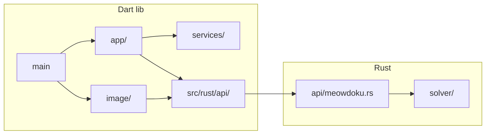

# Project Health Audit — Full Findings

**Recorded:** 2026-06-11 (initial) · **Refreshed:** 2026-06-12 (Phase 7 boundary)  
**Baseline:** [AUDIT_BASELINE.md](AUDIT_BASELINE.md) (2026-06-12 counts)  
**Skills:** tech-lead, code-reviewer, code-quality-gate, tester, eval-engineer

---

## 2026-06-12 refresh summary (Phase 7 boundary)

**Verdict:** **WARN → improved.** Phase 7 closed oracle/process gaps; structural debt unchanged.

| Category | Prior (Jun 11) | Current (Jun 12) | Action |
|----------|----------------|------------------|--------|
| Merge gate | 46+20 tests | **119+34** (+48 FFI skip) | PASS |
| Oracle independence | 9/12 pending | **strict audit PASS** | Done (Q6) |
| Parse goldens | 01–02 | **01–08** | Done (Q4) |
| Solve gates | 22–30 | **01–02**, **09–17**, 22–30 | Done (Q5–Q6) |
| FFI silent pass | FAIL | **Fixed** — explicit skip | Done (Wave 2) |
| Clipboard coupling | WARN (`main.dart`) | **Fixed** — `clipboard_flow.dart` | Done (Wave 4) |
| Duplicate goldens | WARN | **Open** | Phase 8 H4 |
| Hint truth T1–T5 | Not addressed | **Open** — 0/9 forced on t6 | Phase 8 H1 |
| seq 18–42 gates | Missing | **Partial** — 18–19 deferred | Phase 8 H2+ |
| `doc/` vs `docs/` | WARN | **Unchanged** | Accept |
| Prod solver dedup | Deferred | **Unchanged** | Wave 5 backlog |
| Generated FRB "Tier-1" comment | WARN | **Unchanged** | Low — regen after Rust doc fix |

**Phase 8 entry criteria met:** Tier 1+2 green; strict oracle PASS; EPIC-7 closed.

Sections below retain the **2026-06-11** file-level findings where still applicable; cross-check delta table above for resolved items.

---

## Phase 1 — Structure and organization

### Layout scorecard

| Area | Verdict | Finding |
|------|---------|---------|
| Repo root vs `meowdoku_helper/` | **PASS** | Intentional monorepo: governance + canonical fixtures at root; app in subdirectory. Documented in PM_PLAN. |
| `lib/` layout | **WARN** | `image/`, `app/`, `services/` are clean. No `screens/`/`widgets/` yet — acceptable for placeholder phase; `main.dart` holds too much. |
| `rust/src/` layout | **PASS** | Clean split: `api/` (FRB) vs `solver/` (pure logic). No solver logic in API beyond orchestration. |
| `doc/` vs `docs/` | **WARN** | Confusing dual tree. **`doc/`** = authoritative product docs; **`docs/`** = template/archive with Wordle remnants. |
| Fixture duplication | **WARN** | 4 files duplicated root → `integration_test/fixtures/` for `rootBundle`. Documented in TECH_DEBT; acceptable workaround. |
| Platform runners | **WARN** | DEV_GUIDE claims macOS; app has ios/android only (`rust_builder/` has macOS for FFI build). |

### Extraneous-code checklist

| Item | Path | Verdict | Recommendation |
|------|------|---------|----------------|
| Stale Wordle README | `meowdoku_helper/README.md` | **FAIL** | Rewrite for Star Battle or replace with pointer to root README |
| Template exceptions (6 of 7) | `lib/exceptions/service_exceptions.dart` | **WARN** | Keep `FfiInitializationException` + base; remove unused subclasses |
| Unused `resetAllServices()` | `lib/service_locator.dart` | **WARN** | Remove or wire in tests |
| Archived Wordle docs | `docs/archive/`, `docs/migrations/*WORD*` | **WARN** | Keep archived; add README pointer; do not delete without template sync |
| Lint artifacts | `docs/80_chars_file_list.txt`, `docs/80_chars_remaining.txt` | **FAIL** | Delete — reference deleted Wordle test paths |
| Reference asset | `assets/reference/hint_t5_region_crowding_column5.jpeg` | **PASS** | Documented in FIXTURES.md for EPIC-6; not dead |
| Duplicate golden data | `lib/image/t4_solver_goldens.dart` ↔ `rust/src/solver/t4_fixtures.rs` | **WARN** | ~400 lines mirrored; plan SSOT codegen in Wave 6 |
| `IsolateDecodeResult.ranInBackgroundIsolate` | `lib/image/decode_isolate.dart` | **WARN** | Always `true`; test-only seam — simplify when tests allow |

### Recommended folder moves (deferred to Wave 4)

- Extract clipboard state machine from `main.dart` → `lib/app/clipboard_controller.dart`
- Optional: `lib/screens/home_shell.dart` when real UI lands
- **Do not touch:** `ios/`, `rust_builder/`, `flutter_rust_bridge.yaml`

---

## Phase 2 — Code flow and coupling

### Responsibility audit

| Module | Key files | Should own | Verdict | Issue |
|--------|-----------|------------|---------|-------|
| Entry / orchestration | `main.dart` | App shell | **WARN** | Owns FFI bootstrap, clipboard FSM, status strings, preview layout (~177 lines) |
| Image pipeline | `n_detect.dart`, `decode_isolate.dart` | Parse only | **WARN** | `parseGridFromImage` is 50+ lines mixing bbox, sampling, classification |
| Solver bridge | `solve_parsed_grid.dart` | Marshaling | **PASS** | Thin pass-through; documents intent; tests cover it |
| FFI | `ffi_service.dart`, `api/meowdoku.rs` | Init + API | **WARN** | `calculate_next_move` clones state then diffs for first CAT |
| Solver | `tier1.rs`–`tier4.rs` | Pure CSP | **WARN** | Tier loop pattern repeated; test helpers duplicated across files |

### Coupling diagram

**Coupling notes:**
- `image/` does not import `services/` — good layering
- `main.dart` imports both `image/` and `app/` — acceptable for placeholder; should shrink
- Solver has zero Dart/Flutter deps — good
- Golden data creates cross-language coupling (Dart arrays must match Rust arrays)

### Move vs keep

| Recommendation | Priority |
|----------------|----------|
| **Keep** `solve_parsed_grid.dart` — stable test seam and documents FRB boundary | Now |
| **Move** clipboard FSM from `main.dart` to `app/clipboard_controller.dart` | Wave 4 |
| **Split** `parseGridFromImage` into bbox → sample → classify steps | Wave 3 (with threshold docs) |
| **Refactor** `calculate_next_move` to return placement during propagation | Wave 5 |

---

## Phase 3 — Readability, comments, AI-smell review

### Comment scorecard

| File | Score | Notes |
|------|-------|-------|
| `rust/src/solver/mod.rs` | **needs module doc** | No tier overview or propagation restart model |
| `rust/src/solver/tier1.rs` | **adequate** | Public fns have `///`; internals undocumented |
| `rust/src/solver/tier2.rs` | **adequate** | Same pattern |
| `rust/src/solver/tier3.rs` | **needs function doc** | `apply_locked_sets` sliding-window heuristic unexplained |
| `rust/src/solver/tier4.rs` | **needs function doc** | `dfs_bifurcation` vs `dfs_solve` duplication; propagation overlap unclear |
| `rust/src/solver/board.rs` | **needs module doc** | EMPTY/CAT/BLOCKED semantics only in names |
| `lib/image/n_detect.dart` | **needs function doc** | Thresholds undocumented (see table below) |
| `lib/image/decode_isolate.dart` | **adequate** | Clear worker pattern |
| `lib/app/puzzle_grid_preview.dart` | **adequate** | Simple widget |
| `lib/main.dart` | **adequate** | Placeholder comments present |
| `lib/services/ffi_service.dart` | **adequate** | Double-init handling documented |

### Undocumented thresholds (`n_detect.dart`)

| Constant / magic | Location | Purpose (inferred) |
|------------------|----------|-------------------|
| `0.15`, `0.25` offsets | cell sampling | Avoid edge bleed when classifying cell center vs corner |
| `170`, `75` | `_isCatMarker` | Light center + dark feature = cat face |
| `90`, `25`, `240` | `_isBlockedMarker` | X stroke / bright wash detection |
| `0.55` | `_trimProfileEdge` | Row/col density threshold for bbox trim |
| `mergeThreshold = 32` | `_clusterRegionPalette` | RGB distance for color clustering |
| `minFractionOfDominant = 0.03` | palette clustering | Noise bucket filter |
| `sampleStep = 4`, `quantStep = 16` | color buckets | Performance vs accuracy tradeoff |
| `(maxC - minC) >= 20 && maxC >= 80` | `isRegionFill` | Saturated fill vs background |

### Stale “Tier-1” copy (user-visible bug)

| File | Line | Current | Should say |
|------|------|---------|------------|
| `lib/main.dart` | 86 | `no Tier-1 move` | `no solver move` or `Tiers 1–4 stalled` |
| `lib/app/puzzle_grid_preview.dart` | 40 | `no Tier-1 moves available` | Same |
| `lib/src/rust/api/meowdoku.dart` | 9 (generated comment) | `Tier-1 forced cat` | Regenerate after Rust doc fix (source is correct in `meowdoku.rs`) |

### AI / template smell patterns

| Pattern | Location | Severity | Action |
|---------|----------|----------|--------|
| Silent-pass FFI tests | `ffi_smoke_test.dart`, `rust_ffi_roundtrip_test.dart`, `solve_parsed_grid_test.dart`, `t4_fixture_gate_test.dart` | **FAIL** | `return` on init failure masks red; use explicit skip or fail-fast |
| Template exception bloat | `service_exceptions.dart` | **WARN** | 6 never-thrown exception classes |
| `ranInBackgroundIsolate` always true | `decode_isolate.dart` | **WARN** | Awkward test assertion hook |
| Copy-pasted test helpers | `checkerboard_regions`, `quadrant_regions`, local `idx()` in 4+ Rust test modules | **WARN** | Extract `solver/test_helpers.rs` |
| Duplicate golden arrays | Dart + Rust T4 fixtures | **WARN** | Codegen or single-source |

### Refactor candidates (maintainability risk)

1. **High:** Silent-pass FFI tests — undermines merge confidence
2. **High:** Stale Tier-1 user copy — misleading when DFS ran
3. **Medium:** Document `apply_locked_sets` window heuristic (intentional simplification vs bug)
4. **Medium:** Merge `dfs_bifurcation` / `dfs_solve` shared path
5. **Low:** Trim exception hierarchy
6. **Low:** Remove `resetAllServices()` dead code

---

## Phase 4 — Efficiency review

| Hotspot | File / function | Issue | Verdict |
|---------|-----------------|-------|---------|
| Halo scan | `tier1.rs` `apply_halo_enforcer` | O(n³) full row/col per cat | **accept** at N≤12; note for Phase 6 |
| Naked singles | `tier1.rs` `apply_naked_singles` | Triplicated row/col/region | **refactor in Phase 6** — maintainability |
| Line claims | `tier2.rs` | O(n³) per line | **accept** at N≤12 |
| Locked sets membership | `tier3.rs` `cols.contains` in inner loop | O(n) per check | **refactor in Phase 6** — use HashSet |
| Validation rescans | `tier4.rs` `is_illegal`, `region_counts` | Full board per check | **refactor in Phase 6** under DFS depth |
| API clone-diff | `meowdoku.rs` `calculate_next_move` | O(n²) clone + compare | **refactor in Phase 6** — track placement |
| Board clone in DFS | `tier4.rs` | Multiple clones per branch | **accept** at N≤10 today |
| JPEG full decode | `jpeg_decode.dart` | Full raster when dims-only possible | **accept** — isolate offload |
| `parseGridFromImage` pixel loops | `n_detect.dart` | O(n²) per parse | **accept** — required work |

**Summary:** No fix-now performance blockers for N=9–10. Structural inefficiencies should be addressed alongside EPIC-6 (T4/T5 add propagation cost).

---

## Phase 5 — Test coverage and missing red/green tests

### Module × tier matrix

| Module | Tier 1a | Tier 1b | Tier 2 | Gap severity |
|--------|---------|---------|--------|--------------|
| Solver T1–T4 synthetic | Strong | Partial (roundtrip) | Synthetic board | Low |
| Solver T4 fixtures seq 22–30 | Strong | Strong | Partial (29–30 only) | Low |
| Image parse seq 01–02 | — | Strong | — | Low |
| Image parse seq 03–21 | — | **None** | Partial (08 only) | **High** |
| Image parse seq 31–42 | — | **None** | **None** | **High** |
| FFI init / errors | `init_app` | Weak (silent pass) | Smoke | **Medium** |
| Clipboard lifecycle | — | Partial (mock) | **None** | Medium |
| `main.dart` clipboard FSM | — | **None** | **None** | Medium |
| UI preview | — | Partial (no cat/blocked icons) | Launch only | Low |
| `FfiService` double-init | — | **None** | — | Low |

### Fixture coverage (42 total)

| Gate | Fixtures | Parse golden | Solve golden | Tier 2 E2E |
|------|----------|--------------|--------------|------------|
| Phase 2 (seq 01–02) | 2 | ✅ | ❌ weak | ❌ |
| seq 03–07 | 5 | ❌ | ❌ | ❌ |
| Phase 3 (seq 08) | 1 | ❌ | ❌ | ✅ |
| T2 seq 09–13 | 5 | ❌ | ❌ | ❌ |
| T3 seq 14–17 | 4 | ❌ | ❌ | ✅ seq 14 |
| T4 seq 18–21 | 4 | ❌ | ❌ | ❌ |
| T4 gate seq 22–30 | 9 | ✅ | ✅ | ✅ seq 29–30 |
| seq 31–42 | 12 | ❌ | ❌ | ❌ |

**30 fixtures** have no parse golden and no E2E test.

### Missing red/green tests (ordered by product risk)

#### Tier 1a — Rust

| # | Test | File | Red assertion |
|---|------|------|---------------|
| R1 | Tier-3 API synthetic | `rust/src/api/meowdoku.rs` | 4×4 trap board returns forced index |
| R2 | Tier-4 API synthetic | `rust/src/api/meowdoku.rs` | 4×4 DFS board returns forced index (exists in tier4 tests; add at API level) |
| R3 | Extend T4 gate | `rust/src/solver/t4_fixtures.rs` | seq 20–21, 31–42 after Dart goldens locked |

#### Tier 1b — Dart

| # | Test | File | Red assertion |
|---|------|------|---------------|
| D1 | Fix silent-pass | `test/ffi_smoke_test.dart` (+ 3 others) | Fail or `skip` when native lib absent — never empty pass |
| D2 | Lock seq 01–02 solve | `test/solve_parsed_grid_test.dart` | Exact move index, not range |
| D3 | Parse goldens 03–08 | `test/grid_golden_test.dart` + `grid_goldens.dart` | Locked state/regions arrays |
| D4 | T2/T3 fixture gate | `test/t2_t3_fixture_gate_test.dart` (new) | seq 09–19 parse + solve |
| D5 | Invalid JPEG | `test/jpeg_decode_error_test.dart` (new) | `StateError` on bad bytes |
| D6 | Missing fixture | `test/board_fixture_error_test.dart` (new) | Error when repo walk fails |
| D7 | Blank image N-detect | `test/n_detect_error_test.dart` (new) | `StateError('No region fill')` |
| D8 | FFI double-init | `test/ffi_service_test.dart` (new) | Second init succeeds; exception on real failure |
| D9 | Clipboard FSM | `test/main_clipboard_flow_test.dart` (new) | Status strings + preview on mock paste |
| D10 | Cat/blocked cells | `test/puzzle_grid_preview_test.dart` | Icons for state 1 and 2 |

#### Tier 2 — Integration

| # | Test | File | Red assertion |
|---|------|------|---------------|
| I1 | seq 15–19 E2E | `integration_test/app_smoke_test.dart` | Parse → solve → idx ≥ 0 |
| I2 | seq 20–21 E2E | same | T3/T4 boards on device |
| I3 | seq 31–32 E2E | same | 10×10 sprawl boards |
| I4 | Full clipboard flow | new integration test | Resume → preview visible |
| I5 | Bundle strategy | `integration_test/fixtures/` | Add JPEGs for new E2E cases |

#### Doc/process

| # | Item | Action |
|---|------|--------|
| DOC1 | `docs/TESTING_STRATEGY.md` | Rewrite for Star Battle or mark deprecated |
| DOC2 | `.cursor/skills/TEST_TDD.md` | Update test category table |
| DOC3 | `doc/QC_STATUS.md` | Refresh counts (46 + 20 + 6) |

---

## Phase 6 pointer

Remediation waves and TECH_DEBT updates: see [TECH_DEBT.md](../../TECH_DEBT.md) § Audit remediation waves (2026-06-11).
