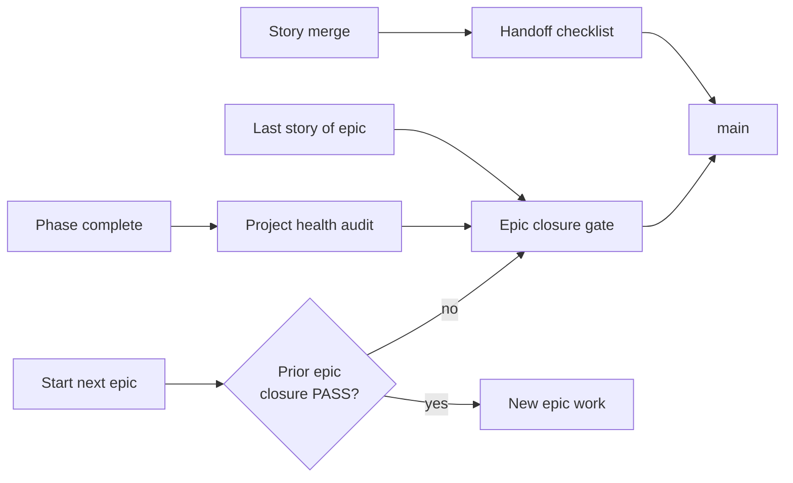

# SDLC — MeowdokuHelper

Lightweight software development lifecycle for humans and agents. **Enforcement lives in rules, skills, and scripts** — this doc explains the rhythm.

**Related:** [RELEASE.md](../RELEASE.md) · [AGENT_HANDOFF.md](../AGENT_HANDOFF.md) · [EPICS_AND_STORIES.md](plan/EPICS_AND_STORIES.md)

---

## Three gates (do not confuse them)



| Gate | Frequency | Purpose |
|------|-----------|---------|
| **Handoff checklist** | Every story merge | Review, tests, local handoff note |
| **Epic closure** | **Every epic finish** | Branch cleanup, doc sync, debt, coverage snapshot |
| **Project health audit** | **Phase boundaries** + on demand | Deep structure/quality/coverage review |

Your initial question (structure, dead code, efficiency, comments, test gaps) maps to **project-health-audit**. Running that **every epic** is too heavy — run **epic closure** every epic and **full audit** when a PM_PLAN phase completes or before a major new phase (e.g. Phase 6).

---

## Epic closure (after each epic)

**Skill:** [.cursor/skills/epic-closure-gate/SKILL.md](../.cursor/skills/epic-closure-gate/SKILL.md)  
**Rule:** [.cursor/rules/epic-closure.mdc](../.cursor/rules/epic-closure.mdc)  
**Script:** `scripts/epic_closure_check.sh`

### Checklist

1. `flutter analyze && flutter test && cd rust && cargo test --lib`
2. `git branch --merged main` → delete merged locals/remotes
3. Tech-debt-evaluator → `TECH_DEBT.md`
4. Sync `AGENT_HANDOFF`, `PROJECT_STATUS`, `QC_STATUS`, epic status in `EPICS_AND_STORIES`
5. Write handoff note (`.cursor/handoff/NNNN-handoff-*.md`)
6. Run `./scripts/epic_closure_check.sh`

### Definition of done

An epic is **Done** in `EPICS_AND_STORIES` only when epic closure is **PASS**.

---

## Project health audit (phase boundaries)

**Skill:** [.cursor/skills/project-health-audit/SKILL.md](../.cursor/skills/project-health-audit/SKILL.md)

Run when:

- A **PM_PLAN phase** completes (e.g. Phase 5 → starting Phase 6)
- User asks for codebase health / coverage / refactor planning
- Before large cross-cutting work (new solver tiers, FFI, major refactors)

**Deliverables:** `AUDIT_BASELINE.md`, `PROJECT_HEALTH_AUDIT.md`, updated `TECH_DEBT.md` remediation waves.

Fixes are batched in waves — audit is read-only first, then remediate.

---

## Building & enforcing the rule

### Already in repo

| Artifact | Role |
|----------|------|
| `.cursor/skills/epic-closure-gate/SKILL.md` | Agent procedure (every epic) |
| `.cursor/skills/project-health-audit/SKILL.md` | Agent procedure (phase / deep) |
| `.cursor/rules/epic-closure.mdc` | Triggers when epic/phase docs edited |
| `.cursor/rules/handoff-checklist.mdc` | Per-story (existing) |
| `scripts/epic_closure_check.sh` | Mechanical PASS/FAIL |
| `RELEASE.md` § SDLC cadence | Policy source |
| `.github/pull_request_template.md` | Human PR checkbox |

### Agent enforcement

- `always.mdc` references epic closure before next epic
- Opening `EPICS_AND_STORIES.md` or `PM_PLAN.md` applies `epic-closure.mdc`
- Agent must not mark epic **Done** until closure checklist complete

### Human enforcement

- PR template: **Epic closure** section when PR closes an epic
- Reviewer checks `epic_closure_check.sh` output or handoff note
- `doc/PROJECT_STATUS.md` *Next up* only advances after closure

### Optional CI (future)

Add a scheduled workflow or `main` post-merge job:

```yaml
# .github/workflows/epic-closure.yml (example — not wired yet)
- run: ./scripts/epic_closure_check.sh
```

Fails on merged branches left behind or doc SHA drift. Not required for day-one enforcement.

---

## Cadence cheat sheet

| You finished… | Run |
|---------------|-----|
| One user story | Handoff checklist |
| EPIC-N (all stories on main) | **Epic closure gate** |
| PM_PLAN Phase N | Epic closure + **Project health audit** |
| About to start EPIC-N+1 | Confirm EPIC-N closure PASS |

---
