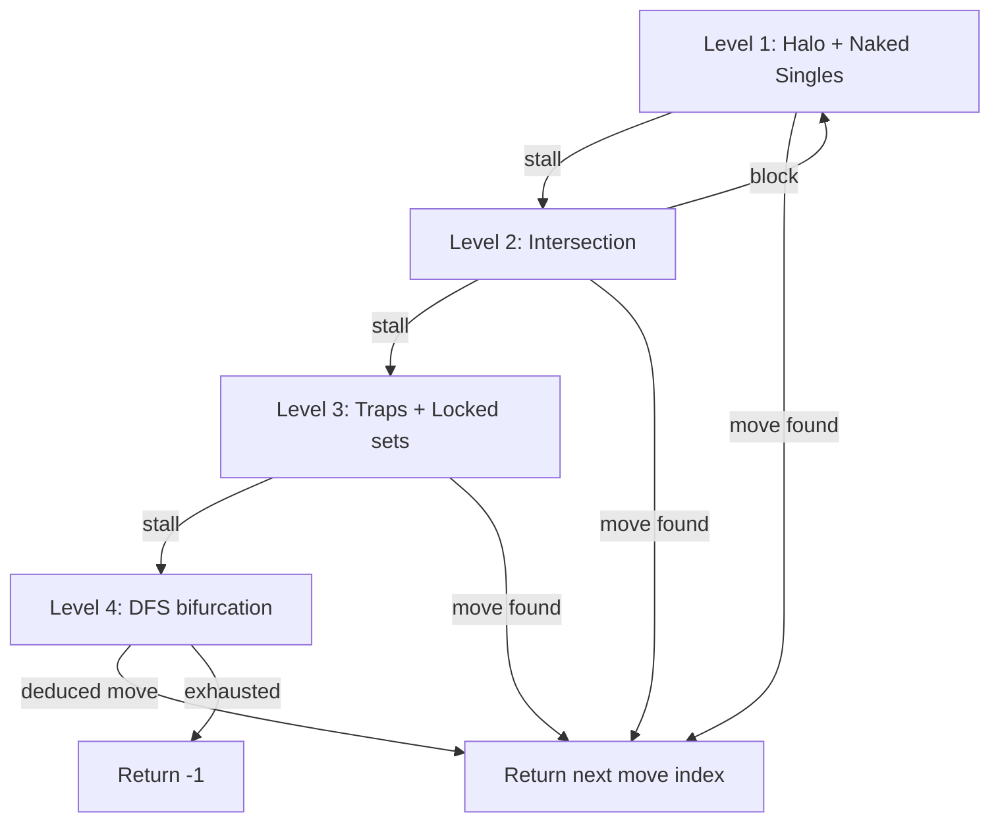

# CSP solver algorithms — master list

Canonical reference for Rust solver development order. **Run the cheapest math first; escalate only when the board stalls.**

Maps to [product.md](product.md) tiers, [PM_PLAN.md](../../PM_PLAN.md) Phase 4, and EPIC-4 stories (US-4.1–4.3).

**Implementation status:** Tier 1–3 shipped (Phase 1, Phase 4a–4b). Tier 4 planned (Phase 4c).

---

## Level 1 — The Sweepers (Beginner)

Computational cost: cheap **O(N)** loops. No cross-group reasoning — inspect raw board state only.

| # | Algorithm | Role | Rust module (target) |
|---|-----------|------|----------------------|
| 1 | **Halo Enforcer** (state update) | Not a deduction — runs after every cat placement. For each cat, mark every empty cell in its row, column, and 8-neighbor halo as **Blocked (X)**. | `tier1::apply_halo_enforcer` ✅ |
| 2 | **Naked Singles** (choke point) | Scan all N rows, N columns, and N color regions. If a group has exactly one empty square and zero cats, place a cat there. | `tier1::apply_naked_singles` ✅ |

**Loop:** Halo → Naked Singles → if a cat was placed, restart at Halo. Stop when a full pass makes no changes.

**Acceptance:** `cargo test` Tier 1 cases; fixture gate **T1** in [FIXTURES.md](../plan/FIXTURES.md).

---

## Level 2 — Intersection Logic (Medium)

When Level 1 stalls, compare groups that share boundaries.

| # | Algorithm | Role | Rust module (target) |
|---|-----------|------|----------------------|
| 3 | **Region-claims-line** | All remaining empties in a color region lie on one row (or column). That region’s cat must be on that line → block other empties on the line outside the region. | `tier2::region_claims_line` ✅ |
| 4 | **Line-claims-region** | Inverse: a row/column’s only empties belong to one color region → block that region’s empties outside the line. | `tier2::line_claims_region` ✅ |

**Loop:** On any block, drop back to Level 1.

**Acceptance:** `cargo test` intersection-only synthetic boards; fixture gate **T2**.

---

## Level 3 — Structural Traps (Advanced)

When Levels 1–2 stall, use geometry-specific impossibilities.

| # | Algorithm | Role | Rust module (target) |
|---|-----------|------|----------------------|
| 5 | **2×2 trap avoidance** | Two cats cannot both sit in a 2×2 empty block (halo rule). If placing a cat in cell A would force two cats in a 2×2 elsewhere in the region, mark A blocked. | `tier3::trap_2x2` ✅ |
| 6 | **N-locked sets** (hidden pairs/triples) | Closed ecosystems: N columns whose empties lie in exactly N regions → those regions are locked to those columns; block those colors elsewhere. | `tier3::locked_sets` ✅ |

**Acceptance:** `cargo test` locked-set boards; fixture gate **T3**.

---

## Level 4 — The Failsafe (Expert)

When deterministic logic fails (common on 10×10+), guess safely with backtracking.

| # | Algorithm | Role | Rust module (target) |
|---|-----------|------|----------------------|
| 7 | **DFS / bifurcation** | Pick first empty cell; clone board; try cat; recursively run Levels 1–3. On contradiction (e.g. row with zero cats and zero empties), revert, permanently block that cell, return to Level 1. On full solve, return winning move. | `tier4::dfs_bifurcation` |

**Acceptance:** Complex boards in `cargo test`; returns `-1` when truly stuck; no panic. Fixture gate **T4** and levels 22–30 when screenshots arrive.

---

## Escalation state machine

---

## Fixture validation order

Screenshot fixtures use **seq-prefixed filenames** under `assets/test_fixtures/`. See [FIXTURES.md](../plan/FIXTURES.md) for:

- **Seq** — master test/work order (01 … 30)
- **Pipeline gate** — Phase 2 parse goldens (image → `state`/`regions`)
- **Solver gate** — minimum tier (T1–T4) before that fixture must pass end-to-end solve

Implement and validate algorithms in level order; add fixtures to the golden suite when their solver gate tier ships.
