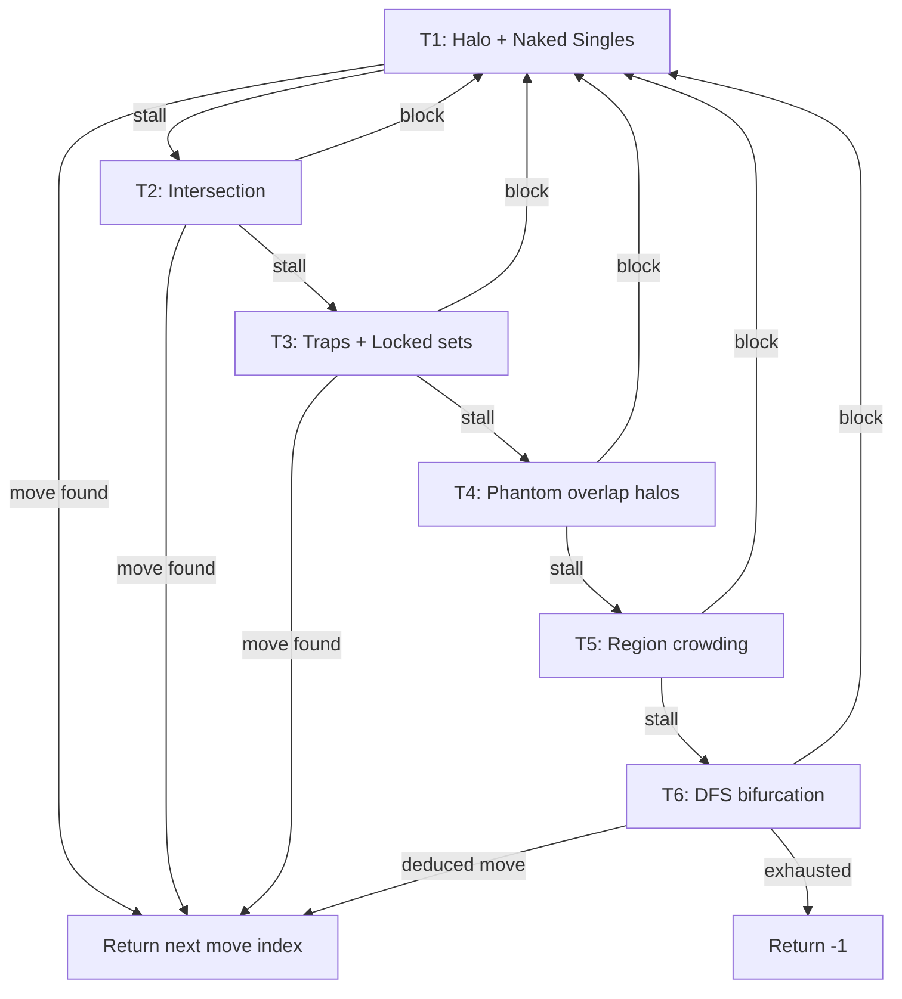

# CSP solver algorithms — master list

Canonical reference for Rust solver development order. **Run the cheapest math first; escalate only when the board stalls.**

Maps to [product.md](product.md), [PM_PLAN.md](../../PM_PLAN.md), and epics in [EPICS_AND_STORIES.md](../plan/EPICS_AND_STORIES.md).

---

## Tier ladder (target)

| Tier | Name | Type | Rust module (target) | Status |
|------|------|------|----------------------|--------|
| **T1** | Halo + Naked Singles | Deterministic | `tier1` | ✅ Shipped |
| **T2** | Intersection logic | Deterministic | `tier2` | ✅ Shipped |
| **T3** | 2×2 traps + N-locked sets | Deterministic | `tier3` | ✅ Shipped |
| **T4** | Phantom Cat Projection (overlap halos) | Deterministic | `tier4_phantom` | ✅ Shipped (US-6.1) |
| **T5** | Region-to-Region Crowding | Deterministic | `tier5` | ✅ Shipped (US-6.2) |
| **T6** | DFS / bifurcation (ultimate failsafe) | Search | `tier4` (DFS module; T6 in ladder) | ✅ Shipped (US-6.3) |

**Correctness note:** T6 (DFS + propagation + `is_illegal`) is mathematically sufficient for every valid board. T4 and T5 are **not required for correctness** — they reduce DFS depth, latency, and “guessing” before the failsafe runs. Implement them only from the exact steps below; do not ask an agent to invent 2D spatial rules.

**Code mapping:** Shipped code uses `run_tiers_1_through_6` — T1–T3 in tier modules, T4 `tier4_phantom`, T5 `tier5`, T6 DFS in `tier4.rs`. FRB signature unchanged.

---

## Level 1 — The Sweepers (Beginner) · T1 ✅

Computational cost: cheap **O(N)** loops. No cross-group reasoning — inspect raw board state only.

| # | Algorithm | Role | Rust module |
|---|-----------|------|-------------|
| 1 | **Halo Enforcer** (state update) | Not a deduction — runs after every cat placement. For each cat, mark every empty cell in its row, column, and 8-neighbor halo as **Blocked (X)**. | `tier1::apply_halo_enforcer` ✅ |
| 2 | **Naked Singles** (choke point) | Scan all N rows, N columns, and N color regions. If a group has exactly one empty square and zero cats, place a cat there. | `tier1::apply_naked_singles` ✅ |

**Loop:** Halo → Naked Singles → if a cat was placed, restart at Halo. Stop when a full pass makes no changes.

**Acceptance:** `cargo test` Tier 1 cases; fixture gate **T1** in [FIXTURES.md](../plan/FIXTURES.md).

---

## Level 2 — Intersection Logic (Medium) · T2 ✅

When Level 1 stalls, compare groups that share boundaries.

| # | Algorithm | Role | Rust module |
|---|-----------|------|-------------|
| 3 | **Region-claims-line** | All remaining empties in a color region lie on one row (or column). That region’s cat must be on that line → block other empties on the line outside the region. | `tier2::region_claims_line` ✅ |
| 4 | **Line-claims-region** | Inverse: a row/column’s only empties belong to one color region → block that region’s empties outside the line. | `tier2::line_claims_region` ✅ |

**Loop:** On any block, drop back to Level 1.

**Acceptance:** `cargo test` intersection-only synthetic boards; fixture gate **T2**.

---

## Level 3 — Structural Traps (Advanced) · T3 ✅

When Levels 1–2 stall, use geometry-specific impossibilities.

| # | Algorithm | Role | Rust module |
|---|-----------|------|-------------|
| 5 | **2×2 trap avoidance** | Two cats cannot both sit in a 2×2 empty block (halo rule). If placing a cat in cell A would force two cats in a 2×2 elsewhere in the region, mark A blocked. | `tier3::trap_2x2` ✅ |
| 6 | **N-locked sets** (hidden pairs/triples) | Closed ecosystems: N columns whose empties lie in exactly N regions → those regions are locked to those columns; block those colors elsewhere. | `tier3::locked_sets` ✅ |

**Acceptance:** `cargo test` locked-set boards; fixture gate **T3**.

---

## Level 4 — Phantom Cat Projection (Overlap Halos) · T4 📋

When T1–T3 stall. **Deterministic** — no guessing.

**Idea:** A region narrowed to 2–3 empty cells that sit close together share halo overlap. Cells in that overlap are dead no matter which candidate gets the cat.

**Algorithm (implement exactly):**

1. Scan every color region that has **exactly 2 or 3** `EMPTY` cells remaining (and zero cats placed in that region).
2. For each such empty cell, compute its standard **8-neighbor halo** (same rule as Halo Enforcer: row, column, and Chebyshev-1 neighbors — exclude the cell itself).
3. Compute the **set intersection** of those halos across all candidate empties in the region.
4. For every cell in the intersection that is currently `EMPTY`, mutate it to `BLOCKED` (`2`).
5. On any block, drop back to T1.

**Acceptance:** Synthetic `cargo test` boards where T1–T3 stall but T4 produces at least one block (or enables a naked single) **without** entering T6. At least one fixture re-gated from **T6 → T4** after EPIC-6.

**Rust target:** `tier4_phantom.rs` (name TBD at implementation — avoid conflating with current `tier4.rs` until rename).

---

## Level 5 — Region-to-Region Crowding (Mutual Destruction) · T5 ✅

When T1–T4 stall. **Deterministic** — simulates one placement, then reverts.

**Idea:** Placing a cat in region A may halo-block every remaining empty in adjacent region B → that placement in A is impossible.

**Algorithm (implement exactly):**

1. For each color region **A**, iterate every `EMPTY` cell in A.
2. **Simulate:** temporarily set that cell to `CAT` (`1`); apply Halo Enforcer for that cat (row, column, 8-neighbors → `BLOCKED`).
3. For every **adjacent** color region **B** (shares an edge with A’s cell or is within the halo footprint — define adjacency as regions that contain at least one cell in the applied halo set, excluding A):
   - Count remaining `EMPTY` cells in B after the simulation.
   - If any adjacent region has **0** empties left, the simulation caused **mutual assured destruction**.
4. **Revert** the simulation (restore board snapshot).
5. If destruction occurred, permanently mutate the trial cell in A to `BLOCKED` (`2`).
6. On any block, drop back to T1.

**Overlap with T6:** DFS already discovers these contradictions via `run_tiers_1_through_3` + `is_illegal` on trial boards. T5 exposes the same logic as a **single-pass deterministic tier** before cloning/recursion.

**Acceptance:** Synthetic `cargo test` boards where T1–T4 stall but T5 blocks at least one cell without T6. Optional: measure reduced DFS depth on seq 22–30 gate fixtures.

**Rust target:** `tier5.rs`.

---

## Level 6 — DFS / Bifurcation (Ultimate Failsafe) · T6 ✅

When T1–T5 stall. DFS is the end of the line for valid puzzles — recursive guess-and-check with propagation.

| # | Algorithm | Role | Rust module |
|---|-----------|------|-------------|
| 7 | **DFS / bifurcation** | Pick first empty cell; clone board; try cat; recursively run T1–T5 (today: T1–T3). On contradiction (row/col/region with zero cats and zero empties), revert, permanently block that cell, return to T1. On full solve, return winning move. | `tier4::dfs_bifurcation` ✅ today |

**Acceptance:** Complex boards in `cargo test`; returns `-1` when truly stuck; no panic. Fixture gate **T6**: seq 22–30 locked in `t6_fixtures.rs` / `t6_solver_goldens.dart`.

---

## Escalation state machine

**Target (after EPIC-6):**

**Shipped (EPIC-6):** Full T1–T6 ladder per escalation diagram below.

---

## Fixture validation order

Screenshot fixtures use **seq-prefixed filenames** under `assets/test_fixtures/`. See [FIXTURES.md](../plan/FIXTURES.md):

- **Seq** — master test/work order (01 … 41)
- **Pipeline gate** — Phase 2 parse goldens (image → `state`/`regions`)
- **Solver gate** — minimum tier before end-to-end solve must pass

**Filename `T{n}` suffix:** seq 22–30 gate uses `_T6_` (requires DFS). Remaining `_T4_` fixtures (seq 18–21, 31–42) are historical — re-audit individually when those boards are re-gated.

Implement and validate algorithms in tier order. **QA** adds synthetic tests from this doc **before** Coder implements; **QA** assigns fixture tier/oracle **before** fixture re-gating ([TEST_PLAN.md](../../TEST_PLAN.md) → QA / Coder separation). Coder does not capture solve goldens from own solver output.

---

## EPIC traceability

| Work | Epic | PM_PLAN |
|------|------|---------|
| T1–T3 + DFS + seq 22–30 gate | EPIC-4 (done) | Phase 4 |
| N>9 end-to-end | EPIC-5 (planned) | Phase 5 |
| T4 Phantom + T5 Crowding + DFS→T6 rename | EPIC-6 | Phase 6 ✅ |
