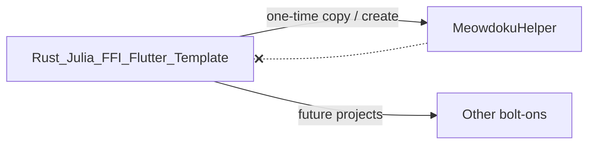

# Template repo — Wordle remnant removal plan

**Target repo:** [Rust_Julia_FFI_Flutter_Template](https://github.com/pbuckles22/Rust_Julia_FFI_Flutter_Template)

**Problem:** The template was bootstrapped from a Wordle helper bolt-on. New projects (e.g. MeowdokuHelper) inherit ~95% Wordle surface area — UI, word lists, solver API, benchmarks, and tests — even when the product is unrelated.

**Goal:** Make the template a **neutral Flutter + Rust + Julia (optional) FFI starter**: build plumbing, `init_app`, one trivial example API, placeholder UI, smoke tests. No Wordle domain code.

**Reference implementation:** MeowdokuHelper Phase 1b.1 on branch `cleanup/wordle-remnants` (seek-and-destroy list + acceptance criteria).

---

## Principles

1. **Template = infrastructure, not product.** FRB codegen, Cargokit, `rust_builder/`, `ios/`, `android/`, `init_app()` — keep. Wordle game logic — remove.
2. **Never hand-edit generated bindings.** Change `rust/src/api/*.rs` → `flutter_rust_bridge_codegen generate`.
3. **Julia hooks stay, runtime stays off.** Build scripts may reference Julia; document “reserved, not invoked” like MeowdokuHelper SDD.
4. **Bolt-on projects must not git-merge the template** after FFI files exist (see MeowdokuHelper `AGENT_HANDOFF.md`). Template cleanup benefits **future** `create`/copy workflows, not in-place merges into MeowdokuHelper.

---

## Current state (inherited from Wordle bolt-on)

Same categories as MeowdokuHelper pre–Phase 1b:

| Layer | Wordle remnants |
|-------|-----------------|
| Rust `api/` | `IntelligentSolver`, `WordManager`, `get_best_guess`, entropy/word filtering |
| Rust other | `benchmarking.rs`, `benchmark_runner.rs`, `bin/benchmark`, `constraint_test.rs` |
| Flutter `lib/` | Wordle screen, grid/tiles/keyboard, game services, word models |
| Assets | `official_wordle_words.json`, `official_guess_words.txt` (~32k lines) |
| Tests | ~45+ Wordle/benchmark/parity tests |
| Docs | SETUP_GUIDE and others still say “Wordle solving” |

---

## Target end state (generic template)

### Rust (`rust/src/`)

| Keep | Remove / replace |
|------|------------------|
| `api/mod.rs`, `api/simple.rs` with `#[frb(init)] init_app()` | Wordle solver modules (`meowdoku_helper.rs` naming → generic or delete) |
| **One** demo API, e.g. `greet(name: String) -> String` or `add(a: i32, b: i32) -> i32` | `get_best_guess`, `WordManager`, `IntelligentSolver`, benchmark APIs |
| `frb_generated.rs` (regenerated) | `benchmarking`, `benchmark_runner`, benchmark bin |
| Empty or `examples/` module stub | Wordle-only tests in `api/` |

Suggested minimal `api/simple.rs`:

```rust
#[flutter_rust_bridge::frb(init)]
pub fn init_app() { flutter_rust_bridge::setup_default_user_utils(); }

#[flutter_rust_bridge::frb(sync)]
pub fn greet(name: String) -> String {
    format!("Hello, {name}!")
}
```

Remove `api/meowdoku_helper.rs` and `api/meowdoku_helper_reference.rs` unless renamed to a **generic** example with no Wordle types.

### Flutter (`lib/`)

| Keep | Remove |
|------|--------|
| `main.dart` — placeholder shell calling `RustLib.init()` | `wordle_game_screen.dart`, all Wordle widgets/models/services |
| `services/ffi_service.dart` — thin `initialize()` wrapper | Game layer, GetIt Wordle wiring (optional: drop GetIt until needed) |
| `lib/src/rust/**` (generated) | — |

Placeholder UI copy: **“FFI Template”** + status line after init (not “Wordle Helper”).

### Assets & pubspec

- Remove `assets/word_lists/`.
- Remove unused deps: `get_it`, `provider`, `json_annotation`, `mockito`, `build_runner`, etc., if nothing references them.
- No product-specific assets in template; document where bolt-ons add assets.

### Tests

Replace ~78 tests with **~4**:

| Test | Purpose |
|------|---------|
| `ffi_smoke_test.dart` | `RustLib.init()` (+ skip note on Windows without native lib) |
| `main_shell_test.dart` | Placeholder title visible |
| `pubspec_configuration_test.dart` | Package name, FRB dep, no word-list assets |
| `integration_test/app_smoke_test.dart` | Device smoke (Mac/iOS) |

Tier 1a: `cd rust && cargo test --lib` — demo API + `init_app` only.

### Docs (template repo)

| File | Action |
|------|--------|
| `README.md` | Neutral FFI template; link to FRB + Cargokit; **no Wordle marketing** |
| `docs/SETUP_GUIDE.md` | Replace “Wordle solving” goal with “neutral FFI starter”; steps use `greet` not `get_best_guess` |
| `docs/TESTING_STRATEGY.md` | Remove TARES/CRANE/word-list references |
| Archive/delete | Wordle migration docs, benchmark guides tied to Wordle |

---

## Phased delivery (template repo)

### Phase T0 — Branch & inventory

- [ ] Branch: `cleanup/neutral-ffi-template`
- [ ] Confirm repo name / default package name (e.g. `my_working_ffi_app` or `ffi_template_app`) — avoid `wrdlHelper` / `meowdoku_helper` in template defaults
- [ ] Grep inventory: `wordle`, `Wordle`, `get_best_guess`, `IntelligentSolver`, `official_wordle`

### Phase T1 — Safe deletes (mirror MeowdokuHelper 1b.1)

Same checklist as [PM_PLAN.md](../PM_PLAN.md) Phase 1b.1:

- [ ] Wordle UI, models, widgets, game services
- [ ] Word-list assets + `pubspec.yaml` assets entry
- [ ] Rust benchmarks + orphan tests
- [ ] Wordle scripts (`benchmark_baseline.py`, etc.)
- [ ] Wordle-only docs / archive
- [ ] ~45 Wordle Flutter tests → 4 smoke tests
- [ ] Placeholder `main.dart` + slim `FfiService`

**Acceptance:** `cargo test --lib` + `flutter test` green (FFI smoke skipped on Windows if applicable).

### Phase T2 — Neutral Rust API + FRB regen

- [ ] Replace Wordle `api/` with `init_app` + `greet` (or equivalent trivial fn)
- [ ] Delete `meowdoku_helper.rs` / `meowdoku_helper_reference.rs` (or generic rename with zero Wordle types)
- [ ] `flutter_rust_bridge_codegen generate`
- [ ] Update `ffi_service.dart` to match generated surface only
- [ ] Verify iOS: `cd ios && pod install && flutter run -d simulator`

**Acceptance:** App shows placeholder + demo string from Rust; no Wordle symbols in `lib/src/rust/`.

### Phase T3 — Naming & generator defaults

- [ ] Default crate/package names in `Cargo.toml`, `pubspec.yaml`, `flutter_rust_bridge.yaml` use neutral placeholder
- [ ] Generated symbol prefix not `WrdlHelper` / `crateApiWrdlHelper` — regen after rename
- [ ] `flutter_rust_bridge_codegen create` docs updated if create-scaffold still emits Wordle paths

### Phase T4 — Bolt-on documentation

- [ ] **Bolt-on README section:** “Copy template → rename package → add product SDD → do not merge template back”
- [ ] Point to MeowdokuHelper as example of product-specific layer (`solver/`, product SDD, Phase 2+ pipeline)
- [ ] Document Agentic layer as **optional manual copy** (MeowdokuHelper pattern), not part of minimal template

---

## Sync relationship: template ↔ MeowdokuHelper



- **Template cleanup** prevents Wordle in **new** projects.
- **MeowdokuHelper** already ran Phase 1b.1 locally; Phase 3 removes remaining Wordle **Rust API** when Star Battle `calculate_next_move` lands.
- **Do not** git-merge template into MeowdokuHelper after FFI customization (FFI fracture risk).
- **Do** port *patterns* (placeholder main, smoke tests, pubspec shape) by reading MeowdokuHelper diff, not blind merge.

---

## Merge-ready gate (template repo)

From template root (adjust package dir if monolithic):

```bash
cd <flutter_app_dir>
flutter pub get
flutter test
cd rust && cargo test --lib && cd ..
# Mac only:
flutter test integration_test/app_smoke_test.dart -d <simulator-or-device>
```

---

## Risks

| Risk | Mitigation |
|------|------------|
| Breaking Cargokit/iOS build | T2 only touches `api/` + regen; run SETUP_GUIDE iOS checklist |
| External clones expect Wordle demo | Major version or README “breaking: neutral template” note |
| Symbol rename breaks docs | Update SETUP_GUIDE examples in same PR |
| Windows `flutter test` without `.dll` | Skip FFI smoke on Windows (MeowdokuHelper pattern) |

---

## Ownership & tracking

| Item | Location |
|------|----------|
| Template work | GitHub: `pbuckles22/Rust_Julia_FFI_Flutter_Template` |
| Product bolt-on cleanup | MeowdokuHelper `PM_PLAN.md` Phase 1b / 3 |
| Mac/iOS test steps | [MAC_IOS_TEST.md](MAC_IOS_TEST.md) |
| Persistent debt | MeowdokuHelper `TECH_DEBT.md` until Phase 3 FRB swap |

**Suggested template PR title:** `Neutralize FFI template — remove Wordle bolt-on remnants`

---

## Done when

- [ ] Template README describes a **generic** FFI starter, not Wordle
- [ ] Zero word-list assets; no `get_best_guess` in Rust public API or generated Dart
- [ ] New clone → rename → run passes iOS simulator smoke without deleting Wordle code first
- [ ] MeowdokuHelper `AGENT_HANDOFF.md` links here for template maintainers
